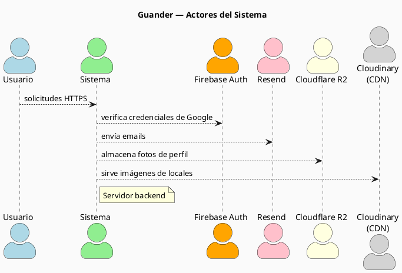
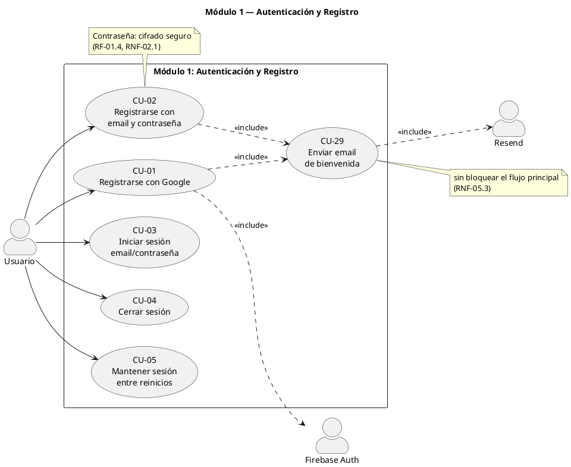
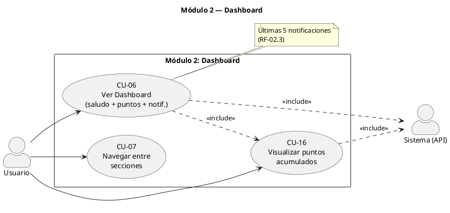
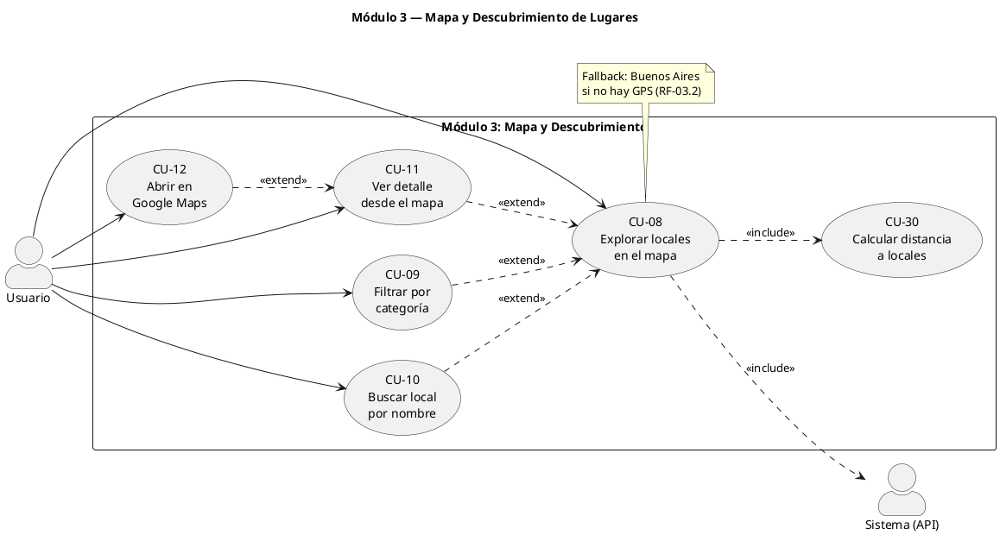
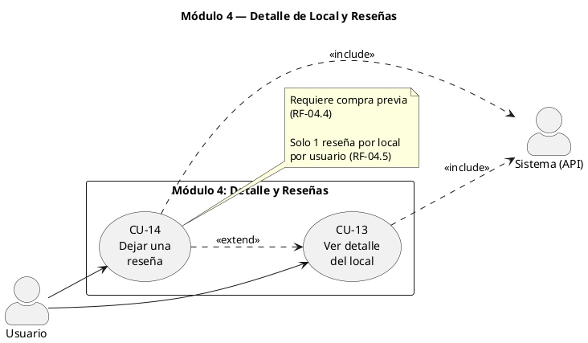
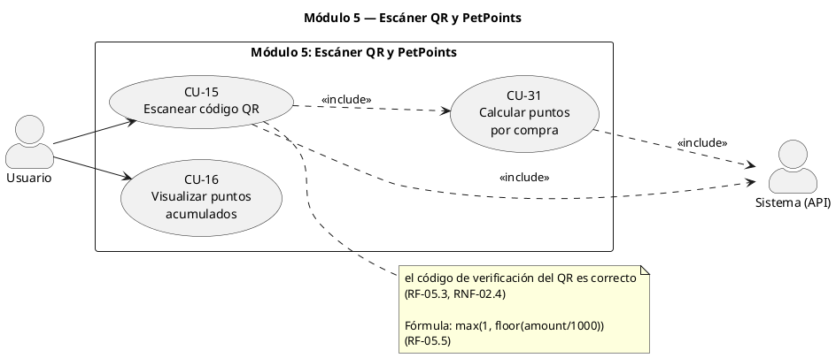
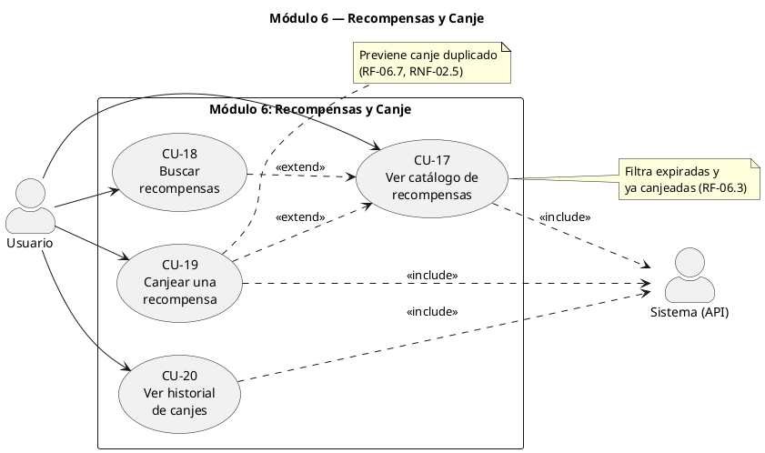
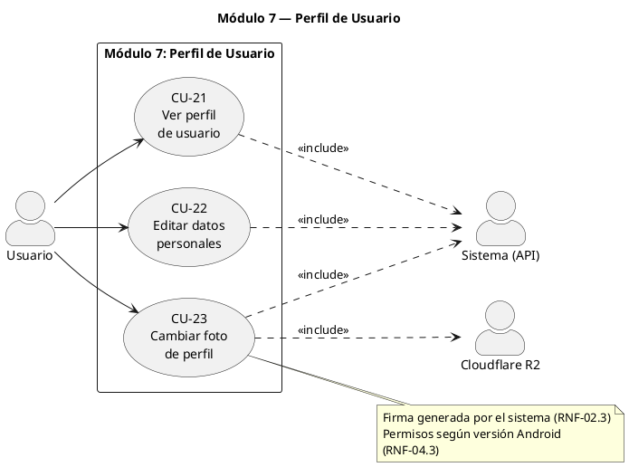
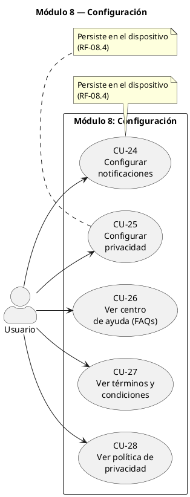
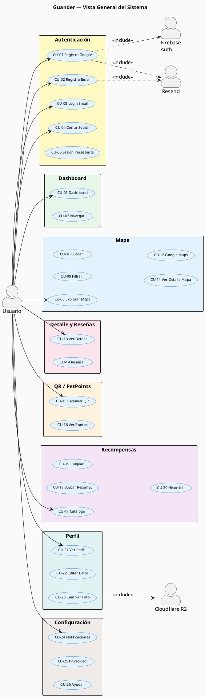

# Guander — Casos de Uso (Informe Completo)

> **Versión:** 2.0 | **Fecha:** Abril 2026 | **Estado:** Vigente

---

## Tabla de contenidos

1. [Introducción](#1-introducción)
2. [Actores del sistema](#2-actores-del-sistema)
3. [Catálogo de casos de uso](#3-catálogo-de-casos-de-uso)
4. [Especificación detallada](#4-especificación-detallada)
5. [Matriz de trazabilidad RF → CU](#5-matriz-de-trazabilidad-rf--cu)
6. [Diagramas PlantUML](#6-diagramas-plantuml)

---

## 1. Introducción

### 1.1 Propósito

Este documento especifica de forma completa los casos de uso del sistema **Guander**, una aplicación móvil Android orientada a dueños de mascotas que conecta a sus usuarios con establecimientos y profesionales pet-friendly. El sistema permite acumular y canjear puntos (PetPoints) mediante escaneo de códigos QR en los locales adheridos.

### 1.2 Alcance

Cubre todos los casos de uso del MVP: la aplicación móvil Android y el servidor backend. Cada caso de uso referencia directamente los requerimientos funcionales (RF-XX.X) y no funcionales (RNF-XX.X) del documento de requerimientos v1.0.

### 1.3 Convenciones de formato

| Elemento | Descripción |
|----------|-------------|
| **Flujo principal** | Camino normal o "happy path" |
| **Flujo alternativo (FA)** | Variación válida del flujo normal |
| **Excepción (EX)** | Condición de error o fallo del sistema |
| `<<include>>` | Sub-caso de uso obligatorio (siempre ocurre) |
| `<<extend>>` | Sub-caso de uso condicional (ocurre bajo ciertas condiciones) |
| **RF-XX.X** | Requerimiento Funcional |
| **RNF-XX.X** | Requerimiento No Funcional |

---

## 2. Actores del sistema

| Actor | Tipo | Descripción |
|-------|------|-------------|
| **Usuario** | Principal | Dueño de mascota que usa la app móvil como cliente de los locales adheridos |
| **Sistema** | Principal | Servidor que procesa todas las solicitudes de la app |
| **Firebase Auth** | Secundario | Servicio externo de autenticación con Google |
| **Resend** | Secundario | Servicio externo de envío de emails transaccionales |
| **Cloudflare R2** | Secundario | Almacenamiento de imágenes de perfil de usuario |
| **Cloudinary** | Secundario | CDN global para imágenes de establecimientos (RNF-05.2) |

---

## 3. Catálogo de casos de uso

| ID | Caso de uso | Módulo | Actores | Prioridad | Requerimientos |
|----|-------------|--------|---------|-----------|----------------|
| CU-01 | Registrarse con Google | Autenticación | Usuario, Firebase Auth, Resend | Alta | RF-01.1, RF-01.5, RF-01.6 |
| CU-02 | Registrarse con email y contraseña | Autenticación | Usuario, Resend | Alta | RF-01.2, RF-01.4, RF-01.6 |
| CU-03 | Iniciar sesión con email y contraseña | Autenticación | Usuario | Alta | RF-01.3, RF-01.4 |
| CU-04 | Cerrar sesión | Autenticación | Usuario | Alta | RF-01.8 |
| CU-05 | Mantener sesión entre reinicios | Autenticación | Usuario | Alta | RF-01.7 |
| CU-06 | Ver Dashboard | Dashboard | Usuario, Sistema (API) | Alta | RF-02.1, RF-02.2, RF-02.3 |
| CU-07 | Navegar entre secciones | Dashboard | Usuario | Alta | RF-02.4 |
| CU-08 | Explorar locales en el mapa | Mapa | Usuario, Sistema (API) | Alta | RF-03.1, RF-03.2, RF-03.3, RF-03.4, RF-03.5 |
| CU-09 | Filtrar locales por categoría | Mapa | Usuario | Media | RF-03.6, RF-03.8 |
| CU-10 | Buscar local por nombre | Mapa | Usuario | Media | RF-03.7, RF-03.8 |
| CU-11 | Ver detalle de local desde el mapa | Mapa | Usuario | Alta | RF-03.9 |
| CU-12 | Abrir establecimiento en Google Maps | Mapa | Usuario | Media | RF-04.2 |
| CU-13 | Ver detalle de un local | Detalle | Usuario, Sistema (API) | Alta | RF-04.1, RF-04.3 |
| CU-14 | Dejar una reseña | Detalle | Usuario, Sistema (API) | Alta | RF-04.4, RF-04.5, RF-04.6, RF-04.7 |
| CU-15 | Escanear código QR | QR/Puntos | Usuario, Sistema (API) | Alta | RF-05.1, RF-05.2, RF-05.3, RF-05.4, RF-05.5, RF-05.6 |
| CU-16 | Visualizar puntos acumulados | QR/Puntos | Usuario, Sistema (API) | Alta | RF-02.2 |
| CU-17 | Ver catálogo de recompensas | Recompensas | Usuario, Sistema (API) | Alta | RF-06.1, RF-06.2, RF-06.3 |
| CU-18 | Buscar recompensas | Recompensas | Usuario | Media | RF-06.4 |
| CU-19 | Canjear una recompensa | Recompensas | Usuario, Sistema (API) | Alta | RF-06.5, RF-06.6, RF-06.7 |
| CU-20 | Ver historial de canjes | Recompensas | Usuario, Sistema (API) | Media | RF-06.8 |
| CU-21 | Ver perfil de usuario | Perfil | Usuario, Sistema (API) | Alta | RF-07.1, RF-07.4 |
| CU-22 | Editar datos personales | Perfil | Usuario, Sistema (API) | Alta | RF-07.2 |
| CU-23 | Cambiar foto de perfil | Perfil | Usuario, Sistema (API), R2 | Media | RF-07.3, RF-07.4 |
| CU-24 | Configurar notificaciones | Configuración | Usuario | Media | RF-08.1, RF-08.4 |
| CU-25 | Configurar privacidad | Configuración | Usuario | Media | RF-08.2, RF-08.4 |
| CU-26 | Ver centro de ayuda | Configuración | Usuario | Baja | RF-08.3, RNF-07.3 |
| CU-27 | Ver términos y condiciones | Configuración | Usuario | Baja | — |
| CU-28 | Ver política de privacidad | Configuración | Usuario | Baja | RNF-07.3 |
| CU-29 | Enviar email de bienvenida | Sistema | Sistema (API), Resend | Baja | RF-01.6, RNF-05.3 |
| CU-30 | Calcular distancia a locales | Sistema | Sistema (API) | Alta | RF-03.3, RF-03.4 |
| CU-31 | Calcular puntos por compra | Sistema | Sistema (API) | Alta | RF-05.5 |

---

## 4. Especificación detallada

---

### Módulo 1: Autenticación y Registro

---

#### CU-01 — Registrarse con Google

| Campo | Detalle |
|-------|---------|
| **ID** | CU-01 |
| **Nombre** | Registrarse con Google |
| **Módulo** | Autenticación y Registro |
| **Actores** | Usuario (principal), Firebase Auth, Resend |
| **Requerimientos** | RF-01.1, RF-01.5, RF-01.6 |
| **Prioridad** | Alta |

**Descripción:** El usuario inicia sesión o crea una cuenta usando su cuenta de Google a través de Firebase Auth. Si el usuario ya existe no se crea un duplicado.

**Precondiciones:**
- Tener conexión a internet
- Tener una cuenta de Google activa
- La app está en la pantalla de Login

**Postcondiciones:**
- Usuario autenticado con sesión activa persistida en el dispositivo
- Perfil creado en la base de datos (si es usuario nuevo)
- Email de bienvenida enviado (si es usuario nuevo)

**Flujo principal:**
1. El usuario abre la app y ve la pantalla de Login
2. Toca el botón "Continuar con Google"
3. Se abre el selector de cuentas de Google (GoogleSignIn Intent)
4. El usuario selecciona su cuenta
5. Firebase Auth valida las credenciales de Google y crea la sesión
6. La app envía `POST /register` con email y displayName al servidor
7. El sistema verifica si el email ya existe en la tabla `users`
8. Si es nuevo, crea registros en `user_data`, `users` y `customer`
9. El sistema llama a Resend para enviar el email de bienvenida de forma sin bloquear el flujo principal (CU-29)
10. La app guarda la sesión activa y redirige al Dashboard

**Flujos alternativos:**
- **FA-1 (usuario existente):** El sistema retorna `{existing: true}` → la app continúa al Dashboard sin crear duplicados ni mostrar error (RF-01.5)

**Excepciones:**
- **EX-1:** Fallo de conexión → Toast "Sin conexión a internet"
- **EX-2:** El usuario cancela la selección de cuenta → regresa a la pantalla de Login sin cambios
- **EX-3:** Firebase Auth retorna error de token → se muestra "Error de autenticación con Google"

**Reglas de negocio:**
- No se crean duplicados si el email ya existe (RF-01.5)
- El email de bienvenida no bloquea el flujo de registro (RNF-05.3)
- La comunicación con la API es exclusivamente sobre HTTPS (RNF-02.2)

---

#### CU-02 — Registrarse con email y contraseña

| Campo | Detalle |
|-------|---------|
| **ID** | CU-02 |
| **Nombre** | Registrarse con email y contraseña |
| **Módulo** | Autenticación y Registro |
| **Actores** | Usuario (principal), Resend |
| **Requerimientos** | RF-01.2, RF-01.4, RF-01.6 |
| **Prioridad** | Alta |

**Descripción:** El usuario crea una cuenta nueva ingresando email, contraseña, nombre, apellido y teléfono. La contraseña se almacena de forma segura, nunca en texto plano.

**Precondiciones:**
- Tener conexión a internet
- No tener cuenta registrada con ese email

**Postcondiciones:**
- Cuenta creada en la base de datos con contraseña hasheada
- Sesión activa persistida en el dispositivo
- Email de bienvenida enviado

**Flujo principal:**
1. El usuario toca "Registrarse con email" en la pantalla de Login
2. Completa el formulario: email, nombre, apellido, teléfono y contraseña (RF-01.2)
3. Toca "Registrarse"
4. La app valida los campos localmente (campos requeridos, formato de email)
5. Envía `POST /register` con todos los datos al servidor
6. El sistema genera el cifrado seguro de la contraseña (RF-01.4)
7. Inserta el usuario en las tablas `users`, `user_data` y `customer`
8. Llama a Resend para enviar el email de bienvenida de forma sin bloquear el flujo principal (CU-29)
9. La app guarda la sesión activa y redirige al Dashboard

**Excepciones:**
- **EX-1:** Email ya registrado → el sistema responde indicando → "Email ya registrado"
- **EX-2:** Campos incompletos → validación local → se marcan los campos con error
- **EX-3:** Fallo de red → Toast "Sin conexión a internet"

**Reglas de negocio:**
- La contraseña nunca se almacena en texto plano (RNF-02.1)
- Se requieren: email, nombre, apellido, teléfono y contraseña (RF-01.2)
- La contraseña se cifra siempre en el servidor (RNF-02.1)

---

#### CU-03 — Iniciar sesión con email y contraseña

| Campo | Detalle |
|-------|---------|
| **ID** | CU-03 |
| **Nombre** | Iniciar sesión con email y contraseña |
| **Módulo** | Autenticación y Registro |
| **Actores** | Usuario (principal) |
| **Requerimientos** | RF-01.3, RF-01.4 |
| **Prioridad** | Alta |

**Descripción:** El usuario accede a su cuenta existente con email y contraseña. El sistema verifica el cifrado seguro almacenado y devuelve los datos del usuario.

**Precondiciones:**
- Tener conexión a internet
- Tener cuenta registrada con email y contraseña

**Postcondiciones:**
- Sesión activa persistida en el dispositivo
- Usuario redirigido al Dashboard

**Flujo principal:**
1. El usuario ingresa su email y contraseña en la pantalla de Login
2. Toca "Iniciar sesión"
3. La app envía `POST /login-email` con email y contraseña al servidor
4. El sistema obtiene el hash almacenado y verifica contra la contraseña recibida (RF-01.4)
5. Si coincide, confirma el éxito con los datos del usuario
6. La app guarda la sesión activa y redirige al Dashboard

**Excepciones:**
- **EX-1:** Credenciales incorrectas → el sistema responde indicando → "Credenciales incorrectas"
- **EX-2:** Email no registrado → el sistema responde indicando → "Usuario no encontrado"
- **EX-3:** Fallo de red → Toast de error

**Reglas de negocio:**
- La verificación de credenciales se realiza siempre en el servidor, nunca en la app (RNF-02.1)

---

#### CU-04 — Cerrar sesión

| Campo | Detalle |
|-------|---------|
| **ID** | CU-04 |
| **Nombre** | Cerrar sesión |
| **Módulo** | Autenticación y Registro |
| **Actores** | Usuario (principal) |
| **Requerimientos** | RF-01.8 |
| **Prioridad** | Alta |

**Descripción:** El usuario cierra su sesión activa. Se elimina tanto la sesión de Firebase Auth como todos los datos locales almacenados en el dispositivo.

**Precondiciones:**
- Estar autenticado

**Postcondiciones:**
- Sesión de Firebase Auth cerrada
- Datos locales (el almacenamiento local del dispositivo) eliminados
- App en la pantalla de Login

**Flujo principal:**
1. El usuario navega a la sección Perfil
2. Toca el botón "Cerrar sesión"
3. Se muestra un diálogo de confirmación
4. El usuario confirma
5. Se llama a `FirebaseAuth.getInstance().signOut()`
6. Se llama a `GoogleSignIn.getClient(context, gso).signOut()`
7. Se limpian todas las el almacenamiento local del dispositivo (email, datos de sesión guardados
8. La app redirige a la pantalla de Login

**Flujos alternativos:**
- **FA-1:** El usuario cancela el diálogo de confirmación → no se realiza ninguna acción

---

#### CU-05 — Mantener sesión entre reinicios

| Campo | Detalle |
|-------|---------|
| **ID** | CU-05 |
| **Nombre** | Mantener sesión entre reinicios |
| **Módulo** | Autenticación y Registro |
| **Actores** | Usuario (principal) |
| **Requerimientos** | RF-01.7 |
| **Prioridad** | Alta |

**Descripción:** Al reiniciar la app, el sistema detecta si existe una sesión activa y redirige directamente al Dashboard sin requerir que el usuario inicie sesión nuevamente.

**Precondiciones:**
- El usuario se autenticó previamente (CU-01, CU-02 o CU-03)
- No ejecutó cerrar sesión (CU-04)

**Postcondiciones:**
- El usuario accede al Dashboard sin volver a autenticarse

**Flujo principal:**
1. El usuario abre la app (reinicio o reingreso desde segundo plano)
2. La pantalla de inicio verifica si hay email guardado en el dispositivo
3. Si existe, verifica si el usuario de Firebase sigue autenticado (`FirebaseAuth.getCurrentUser() != null`)
4. Si ambas condiciones se cumplen, redirige directamente al Dashboard
5. Si no se cumplen, redirige a la pantalla de Login

**Excepciones:**
- **EX-1:** la sesión expiró → el usuario se redirige al Login para re-autenticar

---

### Módulo 2: Dashboard

---

#### CU-06 — Ver Dashboard

| Campo | Detalle |
|-------|---------|
| **ID** | CU-06 |
| **Nombre** | Ver Dashboard |
| **Módulo** | Dashboard |
| **Actores** | Usuario (principal), Sistema (API) |
| **Requerimientos** | RF-02.1, RF-02.2, RF-02.3 |
| **Prioridad** | Alta |

**Descripción:** La pantalla principal muestra un saludo personalizado con el nombre del usuario, su saldo actual de PetPoints y las últimas 5 notificaciones con título y descripción.

**Precondiciones:**
- Estar autenticado
- Tener conexión a internet

**Postcondiciones:**
- Dashboard visible con datos actualizados desde el servidor

**Flujo principal:**
1. La app muestra un saludo personalizado con el nombre del usuario (RF-02.1)
2. Muestra indicador de carga mientras se obtienen los datos (RNF-01.2)
3. Llama a `GET /dashboard?email=` para obtener los datos del servidor
4. Muestra el saldo actual de PetPoints con formato numérico (RF-02.2)
5. Muestra las últimas 5 notificaciones con título y descripción cada una (RF-02.3)

**Excepciones:**
- **EX-1:** Sin conexión → se muestra estado vacío con mensaje de error en español (RNF-03.2)

---

#### CU-07 — Navegar entre secciones

| Campo | Detalle |
|-------|---------|
| **ID** | CU-07 |
| **Nombre** | Navegar entre secciones |
| **Módulo** | Dashboard |
| **Actores** | Usuario (principal) |
| **Requerimientos** | RF-02.4, RNF-03.3 |
| **Prioridad** | Alta |

**Descripción:** El usuario accede a las secciones principales de la app mediante el barra de navegación inferior, disponible en todas las pantallas de la aplicación.

**Precondiciones:**
- Estar autenticado

**Postcondiciones:**
- La pantalla de la sección seleccionada se muestra al usuario

**Flujo principal:**
1. El usuario toca un ítem del barra de navegación inferior
2. La app navega a la sección correspondiente: Dashboard, Mapa, QR Scanner, Recompensas o Perfil (RF-02.4)
3. La barra de navegación está disponible en todas las pantallas (RNF-03.3)

---

### Módulo 3: Mapa y Descubrimiento de Lugares

---

#### CU-08 — Explorar locales en el mapa

| Campo | Detalle |
|-------|---------|
| **ID** | CU-08 |
| **Nombre** | Explorar locales en el mapa |
| **Módulo** | Mapa y Descubrimiento |
| **Actores** | Usuario (principal), Sistema (API) |
| **Requerimientos** | RF-03.1, RF-03.2, RF-03.3, RF-03.4, RF-03.5 |
| **Prioridad** | Alta |

**Descripción:** El usuario visualiza un mapa interactivo centrado en su ubicación con marcadores de establecimientos pet-friendly, acompañado de una lista ordenada por distancia. Cada tarjeta muestra nombre, distancia, calificación en estrellas, horarios y estado abierto/cerrado.

**Precondiciones:**
- Estar autenticado
- Tener conexión a internet

**Postcondiciones:**
- Mapa con marcadores de establecimientos visible
- Lista de establecimientos visible, ordenada por distancia ascendente

**Flujo principal:**
1. La app solicita permiso de ubicación GPS en el momento en que se necesita (RNF-04.2)
2. Obtiene las coordenadas actuales del usuario
3. Centra el mapa en la ubicación del usuario (RF-03.2)
4. Llama a `GET /places?lat=&lng=&filter=all`
5. Muestra indicador de carga mientras se obtienen los datos (RNF-01.2)
6. Renderiza marcadores de cada establecimiento en el mapa el mapa (RF-03.1)
7. Muestra la lista de establecimientos debajo del mapa, ordenada por distancia ascendente (RF-03.4)
8. Cada tarjeta muestra: nombre, distancia calculada, estrellas, horarios y estado abierto/cerrado (RF-03.5)
9. Las imágenes de los establecimientos se cargan en segundo plano (RNF-01.3)

**Flujos alternativos:**
- **FA-1 (sin permiso de ubicación):** La app usa las coordenadas de Buenos Aires como fallback y continúa el flujo normal (RF-03.2)

**Excepciones:**
- **EX-1:** Sin conexión → mapa vacío, mensaje de error en español (RNF-03.2)
- **EX-2:** GPS no disponible → fallback a Buenos Aires (RF-03.2)

---

#### CU-09 — Filtrar locales por categoría

| Campo | Detalle |
|-------|---------|
| **ID** | CU-09 |
| **Nombre** | Filtrar locales por categoría |
| **Módulo** | Mapa y Descubrimiento |
| **Actores** | Usuario (principal) |
| **Requerimientos** | RF-03.6, RF-03.8 |
| **Prioridad** | Media |

**Descripción:** El usuario selecciona una categoría de filtro y tanto la lista como los marcadores del mapa se actualizan instantáneamente mostrando solo los establecimientos de esa categoría.

**Precondiciones:**
- Estar en la pantalla del mapa con establecimientos cargados

**Postcondiciones:**
- Lista y marcadores del mapa muestran solo los establecimientos de la categoría seleccionada

**Flujo principal:**
1. El usuario expande el panel de filtros de categoría
2. Selecciona una de las opciones: Todos / Locales / Restaurantes / Profesionales / Servicios (RF-03.6)
3. La lista de establecimientos y los marcadores del mapa se actualizan en tiempo real (filtro local) (RF-03.8)

---

#### CU-10 — Buscar local por nombre

| Campo | Detalle |
|-------|---------|
| **ID** | CU-10 |
| **Nombre** | Buscar local por nombre |
| **Módulo** | Mapa y Descubrimiento |
| **Actores** | Usuario (principal) |
| **Requerimientos** | RF-03.7, RF-03.8 |
| **Prioridad** | Media |

**Descripción:** El usuario escribe en el campo de búsqueda y la lista de establecimientos y los marcadores del mapa se filtran en tiempo real por coincidencia de nombre.

**Precondiciones:**
- Estar en la pantalla del mapa con establecimientos cargados

**Postcondiciones:**
- Lista y marcadores filtrados según el texto ingresado

**Flujo principal:**
1. El usuario escribe en el campo de búsqueda
2. La lista y los marcadores se filtran en tiempo real por nombre del establecimiento (RF-03.7, RF-03.8)

---

#### CU-11 — Ver detalle de local desde el mapa

| Campo | Detalle |
|-------|---------|
| **ID** | CU-11 |
| **Nombre** | Ver detalle de local desde el mapa |
| **Módulo** | Mapa y Descubrimiento |
| **Actores** | Usuario (principal) |
| **Requerimientos** | RF-03.9 |
| **Prioridad** | Alta |

**Descripción:** Al tocar un marcador en el mapa o una tarjeta en la lista, el usuario puede acceder al detalle completo del establecimiento.

**Precondiciones:**
- Estar en la pantalla del mapa con establecimientos cargados

**Postcondiciones:**
- Pantalla de detalle del establecimiento abierta (CU-13)

**Flujo principal:**
1. El usuario toca un marcador en el mapa
2. Se abre un panel emergente con resumen: nombre, distancia y estado abierto/cerrado
3. El usuario toca "Ver detalles"
4. La app navega a la pantalla de detalle completo (CU-13)

**Flujos alternativos:**
- **FA-1:** El usuario toca directamente "Ver detalles y comentarios" desde una tarjeta en la lista → navega a CU-13 sin pasar por el panel emergente

---

#### CU-12 — Abrir establecimiento en Google Maps

| Campo | Detalle |
|-------|---------|
| **ID** | CU-12 |
| **Nombre** | Abrir establecimiento en Google Maps |
| **Módulo** | Mapa y Descubrimiento |
| **Actores** | Usuario (principal) |
| **Requerimientos** | RF-04.2 |
| **Prioridad** | Media |

**Descripción:** Desde el detalle de un establecimiento, el usuario puede abrir su dirección directamente en Google Maps o en cualquier app de navegación disponible en el dispositivo.

**Precondiciones:**
- Estar en la pantalla de detalle de un establecimiento con dirección y/o coordenadas disponibles

**Postcondiciones:**
- App de mapas abierta con la ubicación del establecimiento como destino

**Flujo principal:**
1. El usuario toca el botón "Cómo llegar" o "Ver en Google Maps"
2. La app construye un Intent con `geo:<lat>,<lng>?q=<nombre del local>`
3. El sistema Android muestra el selector de apps de mapas disponibles
4. La app seleccionada se abre con el destino configurado

**Excepciones:**
- **EX-1:** No hay ninguna app de mapas instalada → se muestra mensaje informativo al usuario

---

### Módulo 4: Detalle de Local y Reseñas

---

#### CU-13 — Ver detalle de un local

| Campo | Detalle |
|-------|---------|
| **ID** | CU-13 |
| **Nombre** | Ver detalle de un local |
| **Módulo** | Detalle y Reseñas |
| **Actores** | Usuario (principal), Sistema (API) |
| **Requerimientos** | RF-04.1, RF-04.3 |
| **Prioridad** | Alta |

**Descripción:** Muestra la información completa del establecimiento: foto, nombre, categoría, estado abierto/cerrado, descripción, dirección y teléfono. Incluye el listado de reseñas con avatar, nombre del autor, fecha relativa, estrellas y texto.

**Precondiciones:**
- Estar autenticado
- Tener conexión a internet
- Haber seleccionado un establecimiento (desde CU-11 o directamente)

**Postcondiciones:**
- Información completa del establecimiento visible
- Lista de reseñas visible

**Flujo principal:**
1. La app llama a `GET /place?id=` para obtener los detalles
2. Muestra indicador de carga (RNF-01.2)
3. Muestra: foto del establecimiento, nombre, categoría, estado abierto/cerrado, descripción, dirección y teléfono (RF-04.1)
4. Llama a `GET /reviews?placeId=` para obtener las reseñas
5. Muestra cada reseña con: avatar del autor, nombre, fecha relativa, estrellas y texto (RF-04.3, RNF-03.4)
6. Las imágenes se cargan de forma eficiente en segundo plano (RNF-01.3)

**Excepciones:**
- **EX-1:** Sin conexión → mensaje de error en español (RNF-03.2)

---

#### CU-14 — Dejar una reseña

| Campo | Detalle |
|-------|---------|
| **ID** | CU-14 |
| **Nombre** | Dejar una reseña |
| **Módulo** | Detalle y Reseñas |
| **Actores** | Usuario (principal), Sistema (API) |
| **Requerimientos** | RF-04.4, RF-04.5, RF-04.6, RF-04.7 |
| **Prioridad** | Alta |

**Descripción:** El usuario puede dejar una reseña (1 a 5 estrellas más texto) en un establecimiento, únicamente si realizó al menos una compra allí y no tiene una reseña previa en ese lugar.

**Precondiciones:**
- Estar autenticado y tener conexión a internet
- Estar en el detalle de un establecimiento
- Haber realizado al menos una compra (QR validado) en ese establecimiento (RF-04.4)
- No haber dejado reseña previamente en ese establecimiento (RF-04.5)

**Postcondiciones:**
- Reseña publicada y visible en la lista del establecimiento
- Formulario de reseña oculto

**Flujo principal:**
1. La app verifica con el servidor si el usuario tiene compra previa en el establecimiento
2. Si tiene, muestra el formulario con selector de estrellas (1-5 estrellas) y campo de texto
3. El usuario selecciona la calificación y escribe su comentario
4. Toca "Publicar comentario"
5. La app envía `POST /review` con: email, placeId, rating y comment
6. El sistema verifica la inexistencia de reseña previa y la inserta (RF-04.5)
7. Se recarga la lista de comentarios y el formulario se oculta

**Flujos alternativos:**
- **FA-1 (sin compra previa):** Muestra "No puedes comentar aún — Debes visitar y consumir en este lugar" (RF-04.6)
- **FA-2 (ya dejó reseña):** Muestra "Ya dejaste tu reseña — Solo se permite una reseña por lugar" (RF-04.7)

**Excepciones:**
- **EX-1:** Intento duplicado vía API → el sistema responde indicando "Ya dejaste una reseña en este lugar" (RF-04.5, RNF-02.5)

**Reglas de negocio:**
- Solo se permite una reseña por usuario por establecimiento (RF-04.5)
- La compra previa y la prevención de duplicados se verifican siempre en el servidor (RNF-02.5)

---

### Módulo 5: Escáner QR y PetPoints

---

#### CU-15 — Escanear código QR

| Campo | Detalle |
|-------|---------|
| **ID** | CU-15 |
| **Nombre** | Escanear código QR |
| **Módulo** | Escáner QR y PetPoints |
| **Actores** | Usuario (principal), Sistema (API) |
| **Requerimientos** | RF-05.1, RF-05.2, RF-05.3, RF-05.4, RF-05.5, RF-05.6 |
| **Prioridad** | Alta |

**Descripción:** El usuario escanea el código QR de un establecimiento adherido para registrar su compra y acreditar PetPoints en su cuenta.

**Precondiciones:**
- Estar autenticado y tener conexión a internet
- Haber concedido permiso de cámara (RNF-04.2)

**Postcondiciones:**
- Compra registrada en `purchase_history`
- PetPoints calculados y sumados al balance del usuario
- Diálogo de éxito mostrado con el resumen

**Flujo principal:**
1. La app solicita permiso de cámara en el momento en que se necesita (RNF-04.2)
2. Activa la cámara para escanear el QR (RF-05.1)
3. El usuario apunta la cámara al código QR del establecimiento
4. La app lee la información del QR: `{ tipo, id, nombre del local, monto, producto, código de verificación }` (RF-05.2)
5. Valida localmente que `el código de verificación del QR es correcto` (RF-05.3)
6. Envía `POST /validate-qr` con email y qrData al servidor
7. El sistema re-valida el secret, calcula los puntos con `max(1, floor(amount / 1000))` (RF-05.5), registra la compra y suma los puntos al balance (RF-05.4)
8. Muestra diálogo de éxito con: nombre del local, monto, puntos ganados y nuevo saldo total (RF-05.6)

**Flujos alternativos:**
- **FA-1 (sin permiso de cámara):** Muestra placeholder con botón para abrir configuración del sistema

**Excepciones:**
- **EX-1:** código QR con información inválida → "QR inválido — El código no tiene el formato correcto"
- **EX-2:** Secret incorrecto → el sistema responde indicando → "QR no válido para Guander" (RNF-02.4)
- **EX-3:** Fallo de red → Toast de error en español (RNF-03.2)

**Reglas de negocio:**
- Fórmula: `max(1, floor(monto / 1000))` — mínimo 1 punto garantizado (RF-05.5)
- El sistema verifica que el QR pertenece a Guander para prevenir fraudes (RNF-02.4)
- La validación se re-verifica siempre en el servidor (RNF-02.5)
- Las API keys no están expuestas en el código de la app (RNF-02.6)

---

#### CU-16 — Visualizar puntos acumulados

| Campo | Detalle |
|-------|---------|
| **ID** | CU-16 |
| **Nombre** | Visualizar puntos acumulados |
| **Módulo** | Escáner QR y PetPoints |
| **Actores** | Usuario (principal), Sistema (API) |
| **Requerimientos** | RF-02.2 |
| **Prioridad** | Alta |

**Descripción:** El saldo de PetPoints se muestra en formato numérico en el Dashboard y en la pantalla de Recompensas, siempre actualizado desde el servidor.

**Flujo principal:**
1. El saldo se obtiene mediante `GET /dashboard?email=` o `GET /rewards?email=`
2. Se muestra el total de puntos con formato numérico (RF-02.2)

---

### Módulo 6: Recompensas y Canje

---

#### CU-17 — Ver catálogo de recompensas

| Campo | Detalle |
|-------|---------|
| **ID** | CU-17 |
| **Nombre** | Ver catálogo de recompensas |
| **Módulo** | Recompensas y Canje |
| **Actores** | Usuario (principal), Sistema (API) |
| **Requerimientos** | RF-06.1, RF-06.2, RF-06.3 |
| **Prioridad** | Alta |

**Descripción:** El usuario visualiza el catálogo de recompensas disponibles. Se excluyen las expiradas y las ya canjeadas por ese usuario. Se indica visualmente si tiene puntos suficientes para cada recompensa.

**Precondiciones:**
- Estar autenticado y tener conexión a internet

**Postcondiciones:**
- Catálogo visible sin recompensas expiradas ni ya canjeadas, con indicación de disponibilidad

**Flujo principal:**
1. La app llama a `GET /rewards?email=`
2. El sistema filtra las recompensas expiradas y las ya canjeadas por el usuario (RF-06.3)
3. Muestra indicador de carga (RNF-01.2)
4. Muestra el catálogo con: nombre, descripción, costo en puntos e ícono del local (RF-06.1)
5. Las recompensas canjeables se habilitan; las con puntos insuficientes se deshabilitan visualmente (RF-06.2)

---

#### CU-18 — Buscar recompensas

| Campo | Detalle |
|-------|---------|
| **ID** | CU-18 |
| **Nombre** | Buscar recompensas |
| **Módulo** | Recompensas y Canje |
| **Actores** | Usuario (principal) |
| **Requerimientos** | RF-06.4 |
| **Prioridad** | Media |

**Descripción:** El usuario filtra en tiempo real el catálogo de recompensas escribiendo en el buscador. La búsqueda aplica sobre nombre y descripción.

**Flujo principal:**
1. El usuario escribe en el campo de búsqueda
2. La lista se filtra en tiempo real por nombre o descripción (RF-06.4)

---

#### CU-19 — Canjear una recompensa

| Campo | Detalle |
|-------|---------|
| **ID** | CU-19 |
| **Nombre** | Canjear una recompensa |
| **Módulo** | Recompensas y Canje |
| **Actores** | Usuario (principal), Sistema (API) |
| **Requerimientos** | RF-06.5, RF-06.6, RF-06.7 |
| **Prioridad** | Alta |

**Descripción:** El usuario canjea una recompensa disponible usando sus PetPoints. El sistema deduce los puntos, registra la transacción y muestra el código de canje.

**Precondiciones:**
- Estar autenticado y tener conexión a internet
- Tener puntos suficientes para la recompensa seleccionada

**Postcondiciones:**
- Puntos deducidos del balance del usuario
- Transacción registrada en `redeem_history`
- Código de canje mostrado al usuario

**Flujo principal:**
1. El usuario toca "Canjear" en una recompensa habilitada
2. Se muestra diálogo de confirmación con el costo en puntos (RF-06.5)
3. El usuario confirma
4. La app envía `POST /redeem` con email y rewardId al servidor
5. El sistema verifica que no existe canje previo de esa recompensa (RF-06.7)
6. Deduce los puntos y registra en `redeem_history`
7. Retorna el código de canje generado
8. La app muestra diálogo de éxito con el código de canje (RF-06.6)
9. El balance y el catálogo se actualizan

**Flujos alternativos:**
- **FA-1 (puntos insuficientes):** Botón "Canjear" deshabilitado → el usuario no puede iniciar el flujo

**Excepciones:**
- **EX-1:** Canje duplicado → el sistema responde indicando → "Ya canjeaste esta recompensa" (RF-06.7)
- **EX-2:** Condición de carrera → el sistema previene operaciones duplicadas (RNF-02.5)

**Reglas de negocio:**
- No se puede canjear la misma recompensa dos veces (RF-06.7)
- Los puntos solo se deducen si el canje es exitoso — operación que solo se confirma si todo el proceso fue exitoso (RNF-02.5)

---

#### CU-20 — Ver historial de canjes

| Campo | Detalle |
|-------|---------|
| **ID** | CU-20 |
| **Nombre** | Ver historial de canjes |
| **Módulo** | Recompensas y Canje |
| **Actores** | Usuario (principal), Sistema (API) |
| **Requerimientos** | RF-06.8 |
| **Prioridad** | Media |

**Descripción:** El usuario accede al historial completo de sus canjes con ícono, descripción, fecha relativa, puntos utilizados y código de canje.

**Flujo principal:**
1. El usuario toca la pestaña "Historial" en la pantalla de Recompensas
2. La app llama a `GET /redeem-history?email=`
3. Muestra cada canje con: ícono, descripción, fecha relativa, puntos utilizados y código de canje (RF-06.8)
4. Las fechas se muestran como: "Hoy", "Hace 1 día", "Hace N días" (RNF-03.4)

---

### Módulo 7: Perfil de Usuario

---

#### CU-21 — Ver perfil de usuario

| Campo | Detalle |
|-------|---------|
| **ID** | CU-21 |
| **Nombre** | Ver perfil de usuario |
| **Módulo** | Perfil de Usuario |
| **Actores** | Usuario (principal), Sistema (API) |
| **Requerimientos** | RF-07.1, RF-07.4 |
| **Prioridad** | Alta |

**Descripción:** Muestra la información completa del perfil: avatar, datos personales, estadísticas (lugares visitados, PetPoints, cupones canjeados) y fecha de alta.

**Flujo principal:**
1. La app llama a `GET /profile?email=`
2. Muestra: avatar/foto, nombre, email, teléfono, dirección y fecha de alta (RF-07.1)
3. Muestra estadísticas: lugares visitados, puntos acumulados, cupones canjeados (RF-07.1)
4. Si no hay foto, muestra la inicial del nombre sobre un fondo circular de color (RF-07.4)

---

#### CU-22 — Editar datos personales

| Campo | Detalle |
|-------|---------|
| **ID** | CU-22 |
| **Nombre** | Editar datos personales |
| **Módulo** | Perfil de Usuario |
| **Actores** | Usuario (principal), Sistema (API) |
| **Requerimientos** | RF-07.2 |
| **Prioridad** | Alta |

**Descripción:** El usuario actualiza nombre, apellido, teléfono y dirección desde el formulario de edición de perfil.

**Flujo principal:**
1. El usuario toca "Editar perfil"
2. Se abre el formulario con datos precargados: nombre, apellido, teléfono y dirección (RF-07.2)
3. Modifica los campos deseados y toca "Guardar"
4. La app envía `PUT /profile` con los datos actualizados
5. El sistema actualiza `user_data` y la pantalla se recarga

**Excepciones:**
- **EX-1:** Fallo de red → Toast "Error al guardar cambios" (RNF-03.2)

---

#### CU-23 — Cambiar foto de perfil

| Campo | Detalle |
|-------|---------|
| **ID** | CU-23 |
| **Nombre** | Cambiar foto de perfil |
| **Módulo** | Perfil de Usuario |
| **Actores** | Usuario (principal), Sistema (API), Cloudflare R2 |
| **Requerimientos** | RF-07.3, RF-07.4, RNF-02.3 |
| **Prioridad** | Media |

**Descripción:** El usuario selecciona una nueva foto desde la galería. La imagen se sube al servidor de almacenamiento mediante una firma de seguridad generada por el sistema.

**Precondiciones:**
- Estar autenticado y tener conexión a internet
- Haber concedido permiso de galería/imágenes (RNF-04.2, RNF-04.3)

**Postcondiciones:**
- Nueva foto visible en el perfil del usuario

**Flujo principal:**
1. El usuario toca el ícono de cámara sobre su foto de perfil
2. Se abre el selector de imágenes (API 33+: `READ_MEDIA_IMAGES`; anterior: `READ_EXTERNAL_STORAGE`) (RNF-04.3)
3. El usuario selecciona una imagen de la galería (RF-07.3)
4. La app llama a `POST /sign-upload` para obtener la URL pre-firmada (RNF-02.3)
5. Sube la imagen directamente al sistema de almacenamiento
6. Actualiza `user_data.photo_url` en la base de datos
7. Recarga la foto y se muestra la nueva imagen

**Flujos alternativos:**
- **FA-1 (sin foto):** Muestra la inicial del nombre sobre fondo circular de color (RF-07.4)

**Excepciones:**
- **EX-1:** Sin permiso → solicita el permiso o muestra guía para activarlo
- **EX-2:** Fallo al subir → mensaje de error, la foto anterior se mantiene

**Reglas de negocio:**
- La firma de upload se genera siempre en el servidor, nunca en el cliente (RNF-02.3)
- Los permisos de almacenamiento se diferencian según versión de Android (RNF-04.3)

---

### Módulo 8: Configuración

---

#### CU-24 — Configurar notificaciones

| Campo | Detalle |
|-------|---------|
| **ID** | CU-24 |
| **Nombre** | Configurar notificaciones |
| **Módulo** | Configuración |
| **Actores** | Usuario (principal) |
| **Requerimientos** | RF-08.1, RF-08.4 |
| **Prioridad** | Media |

**Descripción:** El usuario activa o desactiva cada tipo de notificación. Las preferencias se almacenan localmente en el dispositivo.

**Flujo principal:**
1. El usuario navega a Perfil → Notificaciones
2. Visualiza los switches: General, Puntos, Cupones, Lugares nuevos, Promociones (RF-08.1)
3. Activa/desactiva los switches según su preferencia
4. Las preferencias se guardan automáticamente en el dispositivo (RF-08.4)

---

#### CU-25 — Configurar privacidad

| Campo | Detalle |
|-------|---------|
| **ID** | CU-25 |
| **Nombre** | Configurar privacidad |
| **Módulo** | Configuración |
| **Actores** | Usuario (principal) |
| **Requerimientos** | RF-08.2, RF-08.4 |
| **Prioridad** | Media |

**Descripción:** El usuario configura sus preferencias de privacidad: compartir ubicación, datos de uso y contenido personalizado. Las preferencias persisten localmente.

**Flujo principal:**
1. El usuario navega a Perfil → Privacidad y Seguridad
2. Visualiza los switches: Compartir ubicación, Datos de uso, Contenido personalizado (RF-08.2)
3. Activa/desactiva los switches según su preferencia
4. Las preferencias se guardan en el dispositivo (RF-08.4)

---

#### CU-26 — Ver centro de ayuda

| Campo | Detalle |
|-------|---------|
| **ID** | CU-26 |
| **Nombre** | Ver centro de ayuda |
| **Módulo** | Configuración |
| **Actores** | Usuario (principal) |
| **Requerimientos** | RF-08.3, RNF-07.3 |
| **Prioridad** | Baja |

**Flujo principal:**
1. El usuario navega a Perfil → Centro de ayuda
2. Visualiza la lista de FAQs organizadas por categoría (RF-08.3)
3. Visualiza la información de contacto para solicitudes de privacidad (RNF-07.3)

---

#### CU-27 — Ver términos y condiciones

| Campo | Detalle |
|-------|---------|
| **ID** | CU-27 |
| **Nombre** | Ver términos y condiciones |
| **Módulo** | Configuración |
| **Actores** | Usuario (principal) |
| **Requerimientos** | — |
| **Prioridad** | Baja |

**Flujo principal:**
1. El usuario navega a Perfil → Términos y Condiciones
2. Se muestra el texto legal completo con scroll habilitado

---

#### CU-28 — Ver política de privacidad

| Campo | Detalle |
|-------|---------|
| **ID** | CU-28 |
| **Nombre** | Ver política de privacidad |
| **Módulo** | Configuración |
| **Actores** | Usuario (principal) |
| **Requerimientos** | RNF-07.3 |
| **Prioridad** | Baja |

**Flujo principal:**
1. El usuario navega a Perfil → Política de Privacidad
2. Se muestra el texto completo con información de contacto para solicitudes de privacidad (RNF-07.3)

---

### Módulo 9: Sistema Backend

---

#### CU-29 — Enviar email de bienvenida

| Campo | Detalle |
|-------|---------|
| **ID** | CU-29 |
| **Nombre** | Enviar email de bienvenida |
| **Módulo** | Sistema Backend |
| **Actores** | Sistema (principal), Resend |
| **Requerimientos** | RF-01.6, RNF-05.3 |
| **Prioridad** | Baja |

**Descripción:** Tras el registro exitoso de un nuevo usuario, El sistema envía un email de bienvenida a través de Resend en segundo plano, sin bloquear el registro.

**Flujo principal:**
1. El sistema detecta que el usuario es nuevo
2. Llama a la API de Resend de forma sin bloquear el flujo principal con el HTML de bienvenida (RNF-05.3)
3. Resend envía el email al correo registrado
4. El sistema confirma el éxito al cliente independientemente del resultado del email

**Flujos alternativos:**
- **FA-1 (fallo de Resend):** El sistema ignora el error y confirma el éxito de registro → el flujo no se ve afectado (RNF-05.3)

---

#### CU-30 — Calcular distancia a locales

| Campo | Detalle |
|-------|---------|
| **ID** | CU-30 |
| **Nombre** | Calcular distancia a locales |
| **Módulo** | Sistema Backend |
| **Actores** | Sistema (principal) |
| **Requerimientos** | RF-03.3, RF-03.4 |
| **Prioridad** | Alta |

**Descripción:** Al recibir `GET /places` con coordenadas del usuario, El sistema calcula la distancia a cada establecimiento usando la cálculo de distancia geográfica y devuelve la lista ordenada por cercanía.

**Flujo principal:**
1. El sistema recibe las coordenadas del usuario (lat/lng)
2. Calcula la distancia a cada establecimiento con la cálculo de distancia geográfica (RF-03.3)
3. Ordena los resultados de menor a mayor distancia (RF-03.4)
4. Incluye la distancia calculada en cada objeto de respuesta y devuelve la lista

---

#### CU-31 — Calcular puntos por compra

| Campo | Detalle |
|-------|---------|
| **ID** | CU-31 |
| **Nombre** | Calcular puntos por compra |
| **Módulo** | Sistema Backend |
| **Actores** | Sistema (principal) |
| **Requerimientos** | RF-05.5 |
| **Prioridad** | Alta |

**Descripción:** Al validar un QR exitosamente, El sistema calcula los PetPoints a acreditar con la fórmula establecida, garantizando un mínimo de 1 punto.

**Flujo principal:**
1. El sistema extrae el campo `amount` del QR validado
2. Calcula los puntos: `max(1, floor(amount / 1000))` (RF-05.5)
3. Suma los puntos al balance del `customer`
4. Registra la operación en `points_history` con timestamp

**Reglas de negocio:**
- Mínimo garantizado de 1 punto por compra, independientemente del monto (RF-05.5)

---

## 5. Matriz de trazabilidad RF → CU

| Requerimiento | Descripción breve | Caso(s) de uso |
|---------------|-------------------|----------------|
| RF-01.1 | Registro/login con Google | CU-01 |
| RF-01.2 | Registro con email, nombre, apellido, teléfono | CU-02 |
| RF-01.3 | Login con email y contraseña | CU-03 |
| RF-01.4 | cifrado seguro de contraseña | CU-02, CU-03 |
| RF-01.5 | No duplicar usuario existente en Google | CU-01 |
| RF-01.6 | Email de bienvenida al registrarse | CU-01, CU-02, CU-29 |
| RF-01.7 | Sesión activa persistente entre reinicios | CU-05 |
| RF-01.8 | Cerrar sesión y limpiar datos locales | CU-04 |
| RF-02.1 | Saludo personalizado en Dashboard | CU-06 |
| RF-02.2 | Mostrar saldo de PetPoints | CU-06, CU-16 |
| RF-02.3 | Últimas 5 notificaciones con título y descripción | CU-06 |
| RF-02.4 | Acceso rápido a Mapa, Recompensas, QR, Perfil | CU-07 |
| RF-03.1 | Mapa con marcadores de establecimientos | CU-08 |
| RF-03.2 | Centrar mapa en ubicación / fallback Buenos Aires | CU-08 |
| RF-03.3 | Calcular distancia usuario–establecimiento | CU-08, CU-30 |
| RF-03.4 | Lista ordenada por distancia ascendente | CU-08, CU-30 |
| RF-03.5 | Tarjeta con nombre, dist., estrellas, horarios, estado | CU-08 |
| RF-03.6 | Filtrar por categoría | CU-09 |
| RF-03.7 | Buscar por nombre en tiempo real | CU-10 |
| RF-03.8 | Marcadores se actualizan con filtros y búsqueda | CU-09, CU-10 |
| RF-03.9 | Ver detalle al tocar un establecimiento | CU-11 |
| RF-04.1 | Detalle: foto, nombre, categoría, estado, desc., dir., tel. | CU-13 |
| RF-04.2 | Abrir dirección en Google Maps | CU-12 |
| RF-04.3 | Lista de reseñas: avatar, nombre, fecha, estrellas, texto | CU-13 |
| RF-04.4 | Reseña solo si tiene compra previa | CU-14 |
| RF-04.5 | Impedir reseña duplicada | CU-14 |
| RF-04.6 | Mensaje "No puedes comentar aún" | CU-14 |
| RF-04.7 | Mensaje "Ya dejaste tu reseña" | CU-14 |
| RF-05.1 | Escanear QR con cámara | CU-15 |
| RF-05.2 | QR con JSON: type, id, name, amount, item, secret | CU-15 |
| RF-05.3 | Validar el código de verificación del QR es correcto | CU-15 |
| RF-05.4 | Registrar compra y sumar puntos tras QR válido | CU-15, CU-31 |
| RF-05.5 | Fórmula: max(1, floor(monto / 1000)) | CU-15, CU-31 |
| RF-05.6 | Diálogo con puntos ganados, local y nuevo saldo | CU-15 |
| RF-06.1 | Catálogo: nombre, descripción, costo, ícono | CU-17 |
| RF-06.2 | Indicar visualmente si hay puntos suficientes | CU-17 |
| RF-06.3 | Filtrar recompensas expiradas y ya canjeadas | CU-17 |
| RF-06.4 | Buscar recompensas por nombre o descripción | CU-18 |
| RF-06.5 | Diálogo de confirmación antes de canjear | CU-19 |
| RF-06.6 | Deducir puntos, registrar y mostrar código de canje | CU-19 |
| RF-06.7 | Prevenir canje duplicado de la misma recompensa | CU-19 |
| RF-06.8 | Historial: ícono, descripción, fecha, puntos, código | CU-20 |
| RF-07.1 | Perfil: avatar, datos personales y estadísticas | CU-21 |
| RF-07.2 | Editar nombre, apellido, teléfono y dirección | CU-22 |
| RF-07.3 | Cambiar foto de perfil desde galería | CU-23 |
| RF-07.4 | Avatar con inicial del nombre si no hay foto | CU-21, CU-23 |
| RF-08.1 | Configurar notificaciones (general, puntos, cupones, etc.) | CU-24 |
| RF-08.2 | Configurar privacidad (ubicación, datos, contenido) | CU-25 |
| RF-08.3 | Centro de ayuda con FAQs | CU-26 |
| RF-08.4 | Persistir preferencias localmente | CU-24, CU-25 |
| RNF-02.1 | Contraseñas hasheadas con cifrado seguro | CU-02, CU-03 |
| RNF-02.2 | Comunicación exclusivamente sobre HTTPS | Todos los CU con API |
| RNF-02.3 | Subida de imágenes con firma generada por el sistema | CU-23 |
| RNF-02.4 | QR con secret para prevenir falsificaciones | CU-15 |
| RNF-02.5 | Prevención de operaciones duplicadas del lado del servidor | CU-14, CU-19 |
| RNF-03.4 | Fechas en formato relativo legible | CU-13, CU-20 |
| RNF-04.2 | Permisos en el momento en que se necesita | CU-08, CU-15, CU-23 |
| RNF-04.3 | Permisos de almacenamiento según versión Android | CU-23 |
| RNF-05.3 | Email de bienvenida sin bloquear el flujo principal | CU-29 |
| RNF-07.3 | Información de contacto para privacidad | CU-26, CU-28 |

---

## 6. Diagramas PlantUML

Pegar cada bloque en [PlantUML Online](https://www.plantuml.com/plantuml/uml/) o en cualquier IDE con soporte PlantUML.

---

### Diagrama 0: Actores y relaciones globales

---

### Diagrama 1: Módulo 1 — Autenticación y Registro

---

### Diagrama 2: Módulo 2 — Dashboard

---

### Diagrama 3: Módulo 3 — Mapa y Descubrimiento

---

### Diagrama 4: Módulo 4 — Detalle y Reseñas

---

### Diagrama 5: Módulo 5 — Escáner QR y PetPoints

---

### Diagrama 6: Módulo 6 — Recompensas y Canje

---

### Diagrama 7: Módulo 7 — Perfil de Usuario

---

### Diagrama 8: Módulo 8 — Configuración

---

### Diagrama 9: Vista general del sistema (todos los módulos)

---

*Fin del documento — Guander Casos de Uso v2.0*
