# Diagramas PlantUML — Casos de Uso Guander v2.0

Todos los diagramas usan notación UML de Caso de Uso:
actores como muñeco, elipses para los casos de uso, rectángulo de límite del sistema,
y relaciones `<<include>>` / `<<extend>>` con flecha punteada.

---

## Diagrama General del Sistema

```plantuml
@startuml SISTEMA
left to right direction
title Guander — Diagrama de Casos de Uso General

actor "Usuario" as U

rectangle "Módulo 1: Autenticación" {
  usecase "CU-01\nRegistrarse con Google" as CU01
  usecase "CU-02\nRegistrarse con email" as CU02
  usecase "CU-03\nIniciar sesión" as CU03
  usecase "CU-04\nCerrar sesión" as CU04
  usecase "CU-05\nMantener sesión" as CU05
}
rectangle "Módulo 2: Dashboard" {
  usecase "CU-06\nVer Dashboard" as CU06
  usecase "CU-07\nNavegar secciones" as CU07
}
rectangle "Módulo 3: Mapa" {
  usecase "CU-08\nExplorar locales" as CU08
  usecase "CU-09\nFiltrar por categoría" as CU09
  usecase "CU-10\nBuscar por nombre" as CU10
  usecase "CU-11\nVer detalle desde mapa" as CU11
  usecase "CU-12\nAbrir en Google Maps" as CU12
}
rectangle "Módulo 4: Detalle y Reseñas" {
  usecase "CU-13\nVer detalle de local" as CU13
  usecase "CU-14\nDejar una reseña" as CU14
}
rectangle "Módulo 5: QR / PetPoints" {
  usecase "CU-15\nEscanear QR" as CU15
  usecase "CU-16\nVer puntos acumulados" as CU16
}
rectangle "Módulo 6: Recompensas" {
  usecase "CU-17\nVer catálogo" as CU17
  usecase "CU-18\nBuscar recompensas" as CU18
  usecase "CU-19\nCanjear recompensa" as CU19
  usecase "CU-20\nVer historial canjes" as CU20
}
rectangle "Módulo 7: Perfil" {
  usecase "CU-21\nVer perfil" as CU21
  usecase "CU-22\nEditar datos personales" as CU22
  usecase "CU-23\nCambiar foto de perfil" as CU23
}
rectangle "Módulo 8: Configuración" {
  usecase "CU-24\nConfigurar notificaciones" as CU24
  usecase "CU-25\nConfigurar privacidad" as CU25
  usecase "CU-26\nVer centro de ayuda" as CU26
  usecase "CU-27\nVer términos" as CU27
  usecase "CU-28\nVer política privacidad" as CU28
}
rectangle "Módulo 9: Backend" {
  usecase "CU-29\nEmail bienvenida" as CU29
  usecase "CU-30\nCalcular distancias" as CU30
  usecase "CU-31\nCalcular puntos" as CU31
}

actor "Firebase Auth" as FB <<service>>
actor "Resend" as RS <<service>>
actor "Cloudflare R2" as R2 <<service>>

U --> CU01
U --> CU02
U --> CU03
U --> CU04
U --> CU05
U --> CU06
U --> CU07
U --> CU08
U --> CU09
U --> CU10
U --> CU11
U --> CU12
U --> CU13
U --> CU14
U --> CU15
U --> CU16
U --> CU17
U --> CU18
U --> CU19
U --> CU20
U --> CU21
U --> CU22
U --> CU23
U --> CU24
U --> CU25
U --> CU26
U --> CU27
U --> CU28
CU01 .> CU29 : <<include>>
CU02 .> CU29 : <<include>>
CU08 .> CU30 : <<include>>
CU11 .> CU13 : <<include>>
CU15 .> CU31 : <<include>>
FB --> CU01
RS --> CU29
R2 --> CU23
@enduml
```

---

## CU-01: Registrarse con Google

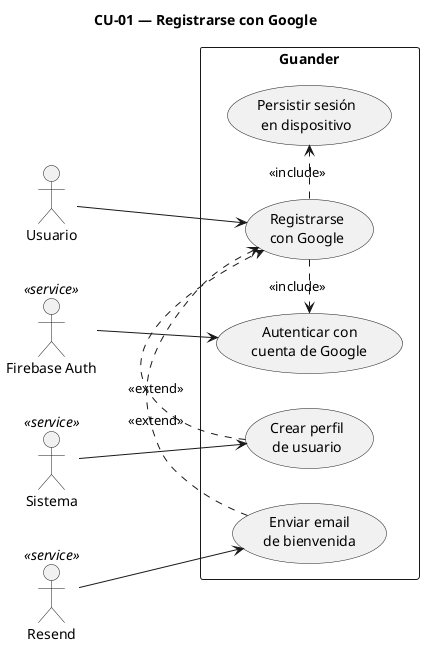

---

## CU-02: Registrarse con email y contraseña

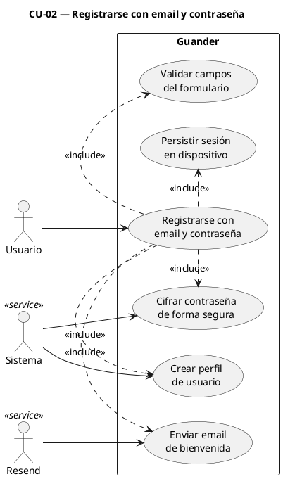

---

## CU-03: Iniciar sesión con email y contraseña

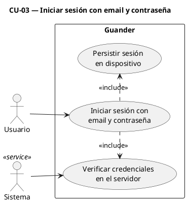

---

## CU-04: Cerrar sesión

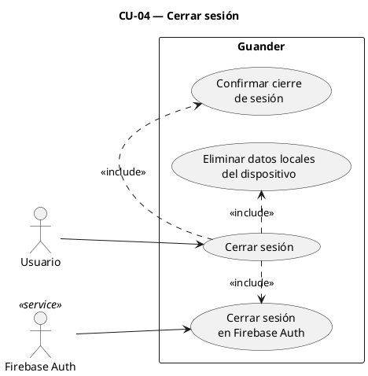

---

## CU-05: Mantener sesión entre reinicios

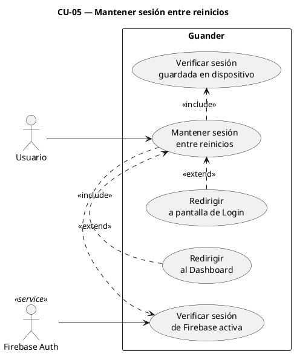

---

## CU-06: Ver Dashboard

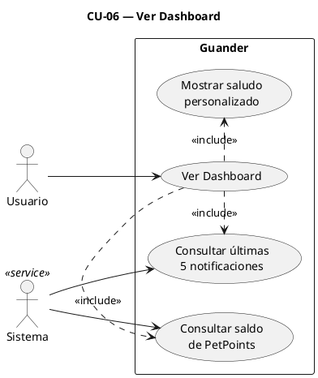

---

## CU-07: Navegar entre secciones

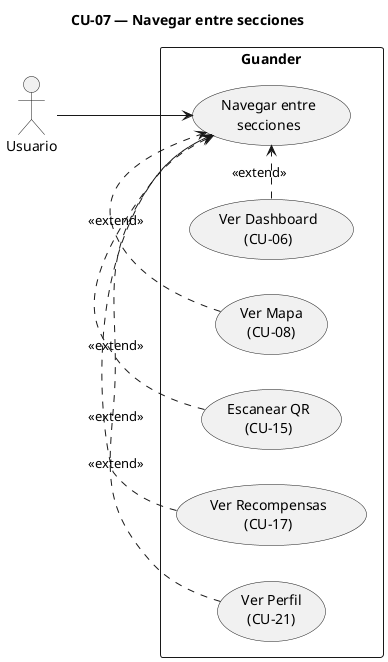

---

## CU-08: Explorar locales en el mapa

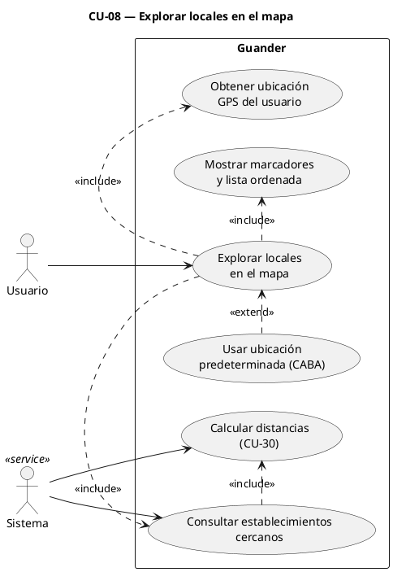

---

## CU-09: Filtrar locales por categoría

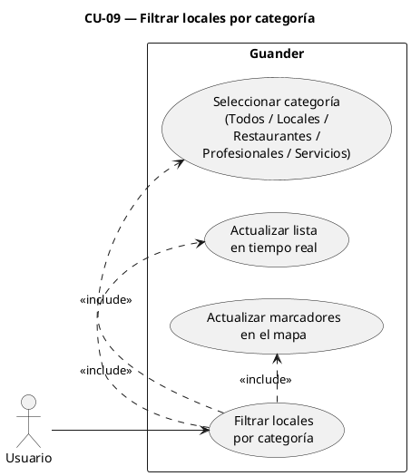

---

## CU-10: Buscar local por nombre

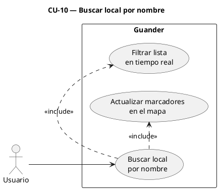

---

## CU-11: Ver detalle de local desde el mapa

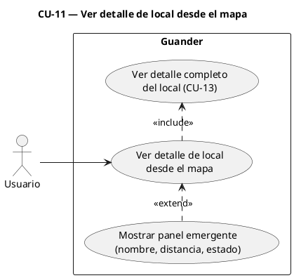

---

## CU-12: Abrir establecimiento en Google Maps

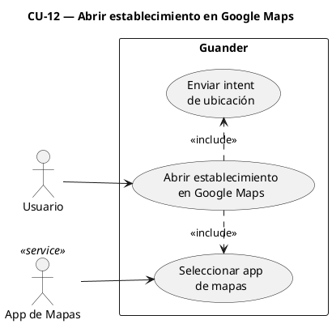

---

## CU-13: Ver detalle de un local

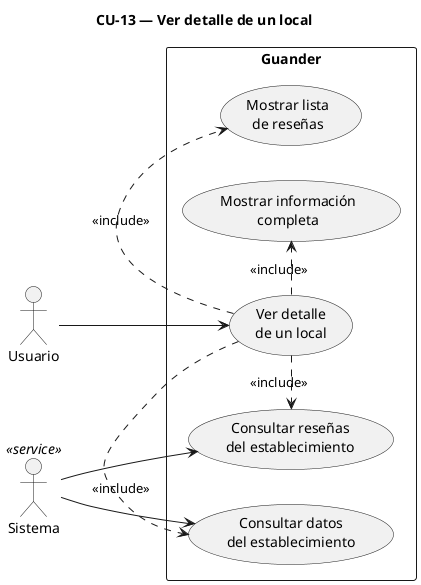

---

## CU-14: Dejar una reseña

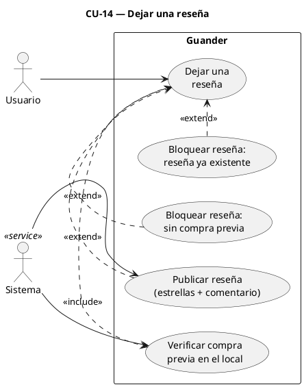

---

## CU-15: Escanear código QR

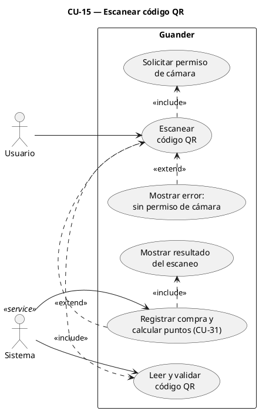

---

## CU-16: Visualizar puntos acumulados

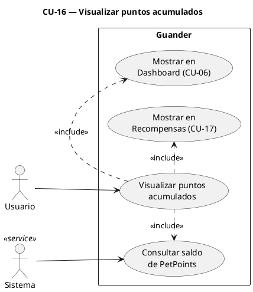

---

## CU-17: Ver catálogo de recompensas

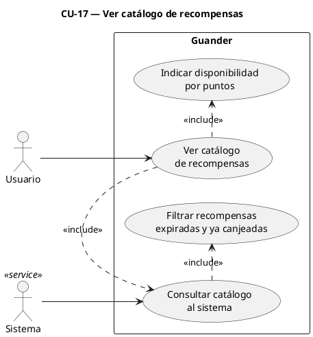

---

## CU-18: Buscar recompensas

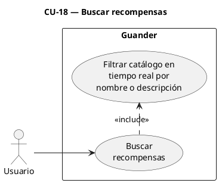

---

## CU-19: Canjear una recompensa

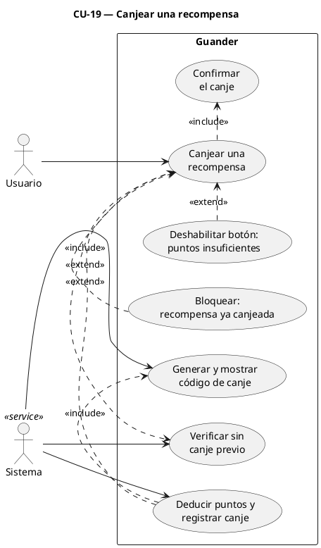

---

## CU-20: Ver historial de canjes

```plantuml
@startuml CU-20
left to right direction
title CU-20 — Ver historial de canjes

actor "Usuario" as U

rectangle "Guander" {
  usecase "Ver historial\nde canjes" as CU20
  usecase "Consultar historial\nal sistema" as UC1
  usecase "Mostrar canjes con\nícono, fecha, puntos\ny código" as UC2
}

actor "Sistema" as Srv <<service>>

U --> CU20
CU20 .> UC1 : <<include>>
CU20 .> UC2 : <<include>>
Srv --> UC1
@enduml
```

---

## CU-21: Ver perfil de usuario

```plantuml
@startuml CU-21
left to right direction
title CU-21 — Ver perfil de usuario

actor "Usuario" as U

rectangle "Guander" {
  usecase "Ver perfil\nde usuario" as CU21
  usecase "Consultar datos\ndel perfil" as UC1
  usecase "Consultar estadísticas\ndel usuario" as UC2
  usecase "Mostrar avatar o\ninicial del nombre" as UC3
}

actor "Sistema" as Srv <<service>>

U --> CU21
CU21 .> UC1 : <<include>>
CU21 .> UC2 : <<include>>
CU21 .> UC3 : <<include>>
Srv --> UC1
Srv --> UC2
@enduml
```

---

## CU-22: Editar datos personales

```plantuml
@startuml CU-22
left to right direction
title CU-22 — Editar datos personales

actor "Usuario" as U

rectangle "Guander" {
  usecase "Editar datos\npersonales" as CU22
  usecase "Precargar formulario\ncon datos actuales" as UC1
  usecase "Guardar cambios\nen el sistema" as UC2
}

actor "Sistema" as Srv <<service>>

U --> CU22
CU22 .> UC1 : <<include>>
CU22 .> UC2 : <<include>>
Srv --> UC1
Srv --> UC2
@enduml
```

---

## CU-23: Cambiar foto de perfil

```plantuml
@startuml CU-23
left to right direction
title CU-23 — Cambiar foto de perfil

actor "Usuario" as U

rectangle "Guander" {
  usecase "Cambiar foto\nde perfil" as CU23
  usecase "Seleccionar imagen\nde la galería" as UC1
  usecase "Obtener firma segura\npara subida" as UC2
  usecase "Subir imagen al\nalmacenamiento" as UC3
  usecase "Actualizar foto\nen el perfil" as UC4
  usecase "Mostrar inicial del\nnombre como avatar" as UC5
}

actor "Sistema" as Srv <<service>>
actor "Cloudflare R2" as R2 <<service>>

U --> CU23
CU23 .> UC1 : <<include>>
CU23 .> UC2 : <<include>>
UC2 .> UC3 : <<include>>
UC3 .> UC4 : <<include>>
UC5 .> CU23 : <<extend>>
Srv --> UC2
R2 --> UC3
@enduml
```

---

## CU-24: Configurar notificaciones

```plantuml
@startuml CU-24
left to right direction
title CU-24 — Configurar notificaciones

actor "Usuario" as U

rectangle "Guander" {
  usecase "Configurar\nnotificaciones" as CU24
  usecase "Activar/desactivar:\nGeneral / Puntos /\nCupones / Lugares / Promo" as UC1
  usecase "Guardar preferencias\nen el dispositivo" as UC2
}

U --> CU24
CU24 .> UC1 : <<extend>>
CU24 .> UC2 : <<include>>
@enduml
```

---

## CU-25: Configurar privacidad

```plantuml
@startuml CU-25
left to right direction
title CU-25 — Configurar privacidad

actor "Usuario" as U

rectangle "Guander" {
  usecase "Configurar\nprivacidad" as CU25
  usecase "Activar/desactivar:\nUbicación / Datos /\nContenido personalizado" as UC1
  usecase "Guardar preferencias\nen el dispositivo" as UC2
}

U --> CU25
CU25 .> UC1 : <<extend>>
CU25 .> UC2 : <<include>>
@enduml
```

---

## CU-26: Ver centro de ayuda

```plantuml
@startuml CU-26
left to right direction
title CU-26 — Ver centro de ayuda

actor "Usuario" as U

rectangle "Guander" {
  usecase "Ver centro\nde ayuda" as CU26
  usecase "Ver preguntas\nfrecuentes por categoría" as UC1
  usecase "Ver información\nde contacto de privacidad" as UC2
}

U --> CU26
CU26 .> UC1 : <<include>>
CU26 .> UC2 : <<include>>
@enduml
```

---

## CU-27: Ver términos y condiciones

```plantuml
@startuml CU-27
left to right direction
title CU-27 — Ver términos y condiciones

actor "Usuario" as U

rectangle "Guander" {
  usecase "Ver términos\ny condiciones" as CU27
  usecase "Mostrar texto legal\ncompleto con scroll" as UC1
}

U --> CU27
CU27 .> UC1 : <<include>>
@enduml
```

---

## CU-28: Ver política de privacidad

```plantuml
@startuml CU-28
left to right direction
title CU-28 — Ver política de privacidad

actor "Usuario" as U

rectangle "Guander" {
  usecase "Ver política\nde privacidad" as CU28
  usecase "Mostrar texto completo\ncon info de contacto" as UC1
}

U --> CU28
CU28 .> UC1 : <<include>>
@enduml
```

---

## CU-29: Enviar email de bienvenida

```plantuml
@startuml CU-29
left to right direction
title CU-29 — Enviar email de bienvenida

actor "Sistema" as Srv

rectangle "Guander" {
  usecase "Enviar email\nde bienvenida" as CU29
  usecase "Llamar al servicio\nde email (asíncrono)" as UC1
  usecase "Confirmar registro\nsin esperar al email" as UC2
}

actor "Resend" as Resend <<service>>

Srv --> CU29
CU29 .> UC1 : <<include>>
CU29 .> UC2 : <<include>>
Resend --> UC1
@enduml
```

---

## CU-30: Calcular distancia a locales

```plantuml
@startuml CU-30
left to right direction
title CU-30 — Calcular distancia a locales

actor "Sistema" as Srv

rectangle "Guander — Backend" {
  usecase "Calcular distancia\na locales" as CU30
  usecase "Calcular distancia\na cada establecimiento" as UC1
  usecase "Ordenar resultados\npor distancia" as UC2
  usecase "Incluir distancia\nen la respuesta" as UC3
}

Srv --> CU30
CU30 .> UC1 : <<include>>
UC1 .> UC2 : <<include>>
CU30 .> UC3 : <<include>>
@enduml
```

---

## CU-31: Calcular puntos por compra

```plantuml
@startuml CU-31
left to right direction
title CU-31 — Calcular puntos por compra

actor "Sistema" as Srv

rectangle "Guander — Backend" {
  usecase "Calcular puntos\npor compra" as CU31
  usecase "Calcular puntos\nsegún monto (mín. 1)" as UC1
  usecase "Sumar puntos al\nsaldo del usuario" as UC2
  usecase "Registrar operación\ncon fecha y hora" as UC3
}

Srv --> CU31
CU31 .> UC1 : <<include>>
CU31 .> UC2 : <<include>>
CU31 .> UC3 : <<include>>
@enduml
```
